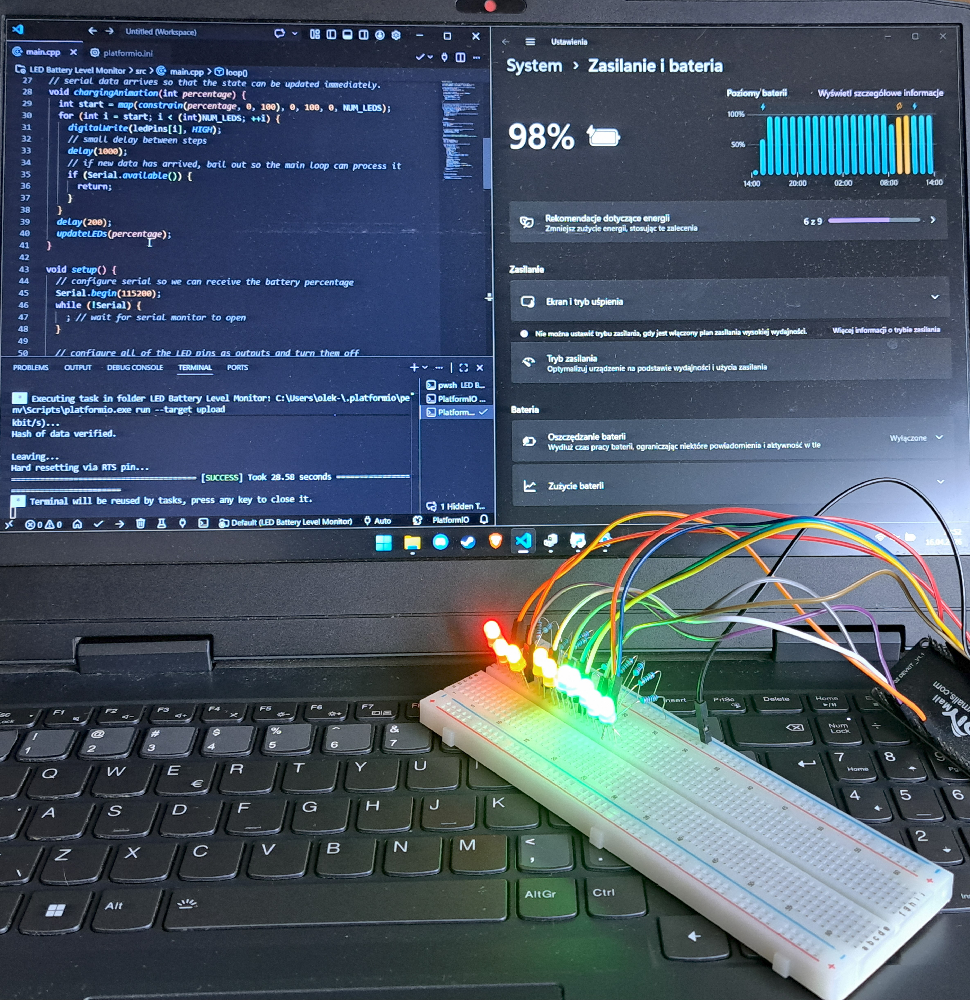

# LED battery level monitoring

It's a small project of mine, that includes using ESP32 and 10 LEDs. I did it as I needed to have a stable way to check battery of my laptop that has ubuntu server on it, without having to run scripts for checking it constantly. It allows for visual representation of the battery percentage of a laptop and wheter it's charging or not.

## Project's Gallery

